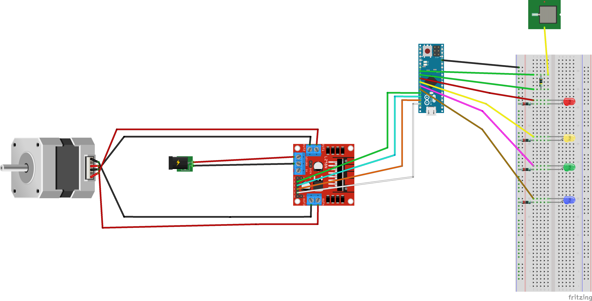

# peristaltic_pump

  ## software
    
   ### -processing & arduino 
       
   ***download all the contents from PROCESSING folder in order to make run correctly the code***
      
   the processing code creates a virtual version of the pump, {arduino_code} pilots both the real and virtual pumps 
       
   
   * * *

  ## hardware requirements 
 
  * NEMA 17 motor 1.5A HS4401 (12V) 
  * Driver L298N  
  * 3x5 mm silicon tube 
  * Arduino Micro 
  
  

 
  * * * 
    
 

